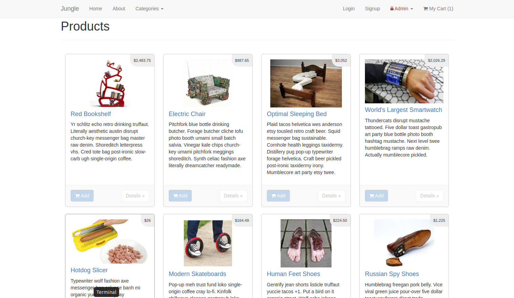
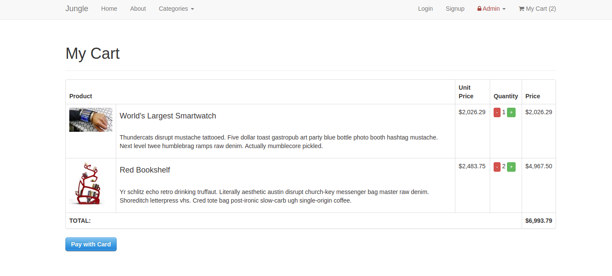
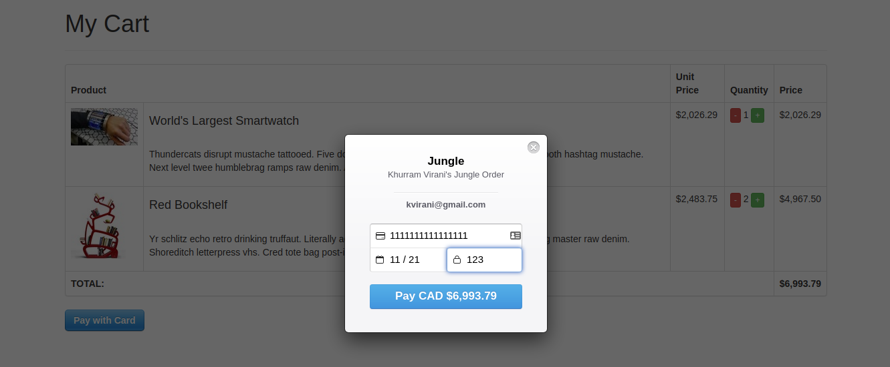
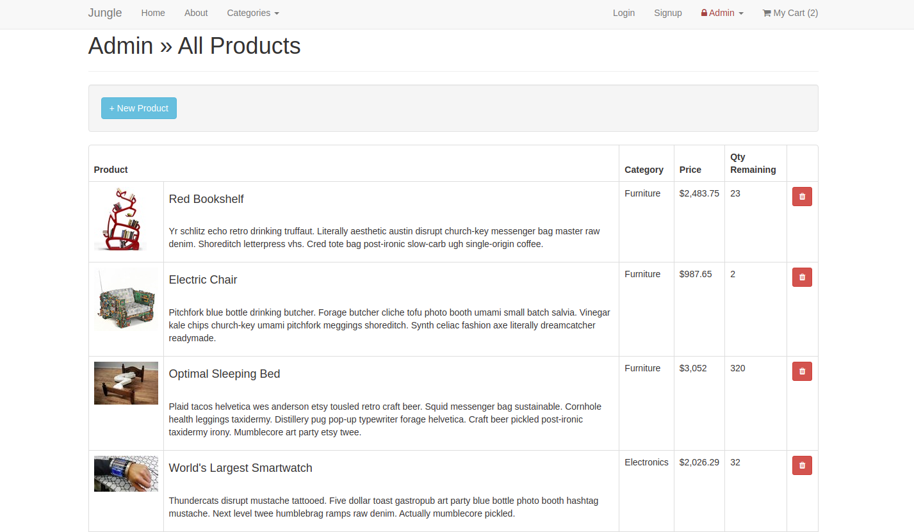
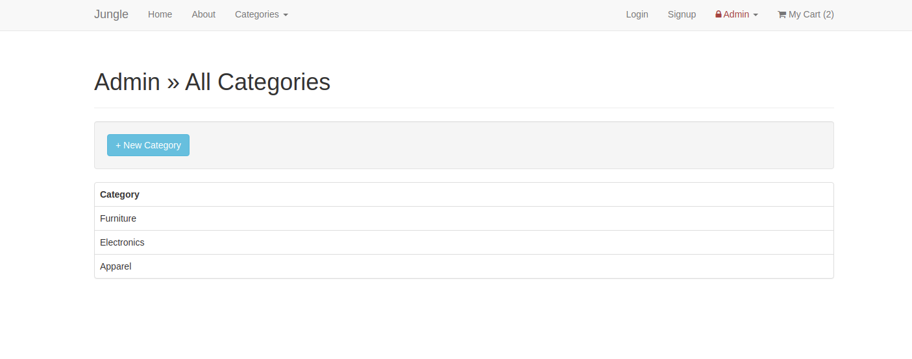

# Jungle

A mini e-commerce application built with Rails 4.2 for purposes of learning Rails by example.

# Features
- It's multipage app where visitors can purchase items by clicking the Add button to be added to My Cart section
- Or by clicking Details will open new page with full datails of the selected product
- My Cart list all selected products with full description, price and quantity to update base on your needs. Changing the quantity to 0 will remove the product from My Cart table
- Using Stripe's fake credit card you can complete the checkout 

# Admin
- You can add fake `USERNAME` and `PASSWORD` inside .env file to login to Admin product section
- Authorized Admin user have access to add and remove products once login and also can add new category for the products.

## Screenshots

###### Jungle Home Page 

###### Order Summary inside My Cart 

###### Payment Section 

###### Admin Product Page 

###### Admin Category Page 

## Additional Steps for Apple M1 Machines

1. Make sure that you are runnning Ruby 2.6.6 (`ruby -v`)
1. Install ImageMagick `brew install imagemagick imagemagick@6 --build-from-source`
2. Remove Gemfile.lock
3. Replace Gemfile with version provided [here](https://gist.githubusercontent.com/FrancisBourgouin/831795ae12c4704687a0c2496d91a727/raw/ce8e2104f725f43e56650d404169c7b11c33a5c5/Gemfile)

## Setup

1. Run `bundle install` to install dependencies
2. Create `config/database.yml` by copying `config/database.example.yml`
3. Create `config/secrets.yml` by copying `config/secrets.example.yml`
4. Run `bin/rake db:reset` to create, load and seed db
5. Create .env file based on .env.example
6. Sign up for a Stripe account
7. Put Stripe (test) keys into appropriate .env vars
8. Run `bin/rails s -b 0.0.0.0` to start the server

## Stripe Testing

Use Credit Card # 4111 1111 1111 1111 for testing success scenarios.

More information in their docs: <https://stripe.com/docs/testing#cards>

## Dependencies

* Rails 4.2 [Rails Guide](http://guides.rubyonrails.org/v4.2/)
* PostgreSQL 9.x
* Stripe

## Authors
Developed by Nahom Mehanzel. You can find me on [LinkedIn](https://www.linkedin.com/in/nahom-mehanzel/) or [Twitter](https://twitter.com/NahomKibreab).

